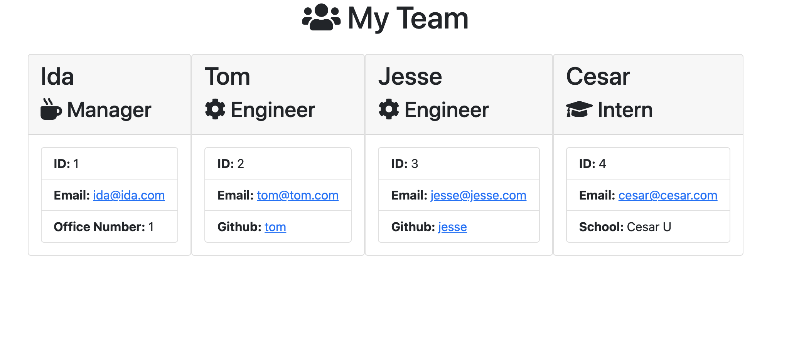

# Team Profile Generator

A Node.js command-line program to create a webpage for your work team. The program takes in managers, engineers, and interns.

## Table of Contents
* [Installation Guide](#Installation)
* [How to Use](#Usage)
* [Test Instructions](#Instructions)
* [License](#License)
* [Contact Info](#Contact)
* [Testing](#Tests)

## Installation
This requires Node.js to install and use. The package.json is already provided, so navigate to the project folder and run npm install.

## Usage
Once you've installed the node modules needed, just run npm index.js and answer the questions. The webpage will generate based on your replies.

## Instructions
- There needs to be at least 1 manager for the program to complete. It is suggested to start with the manager and add employees from there.
- Anytime you run the program, it will replace the HTML - so try to have all your team members and their information ready when you run the program.
- The final deployed page looks similar to below:

## Tests
This program uses Jest to run tests on the objects and extended objects created. Use 'npm jest' to run the tests.

## License
This project is licensed under the MIT license.

©[corgimaman](https://github.com/corgimaman)

## Contact
Questions? Comments? Feel free to reach out to me at helloidaworld@gmail.com or on [GitHub](https://github.com/corgimaman).